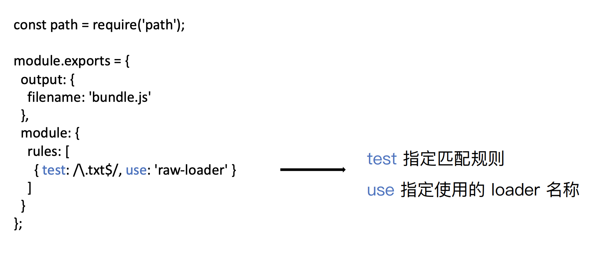
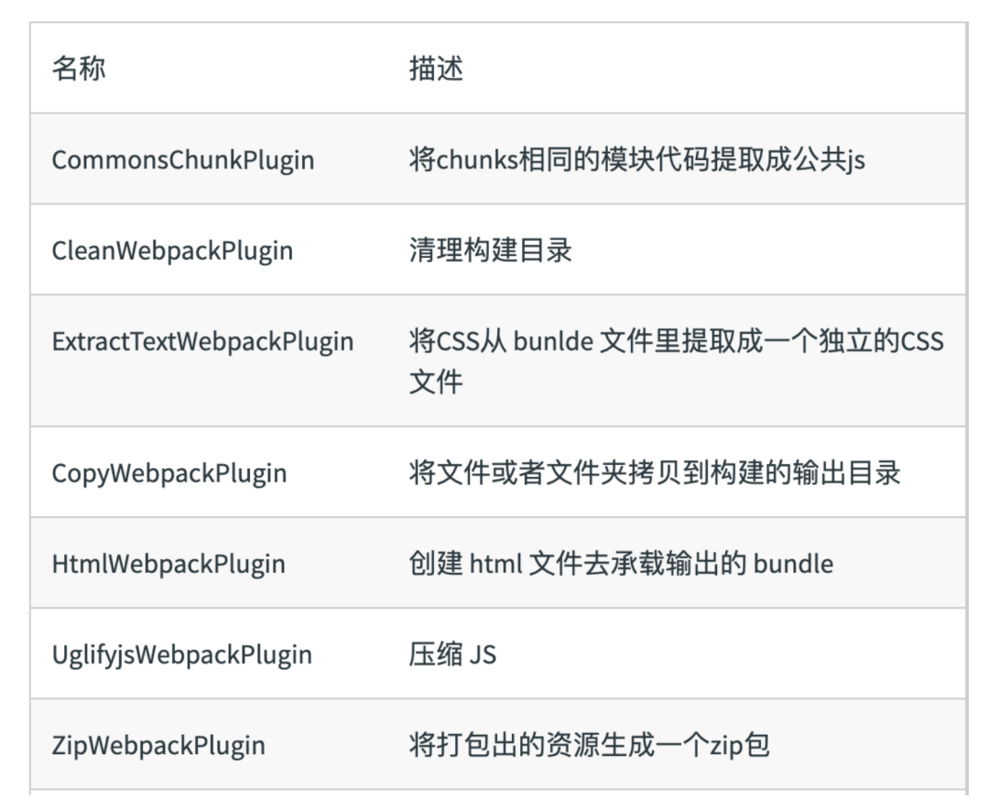
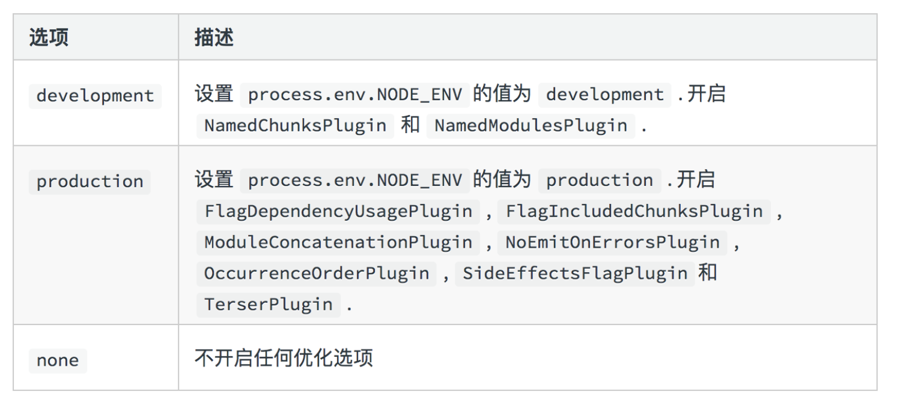

# webpack

## 定义及作用

webpack为打包构建工具，主要作用为：

1. 转换ES6语法
2. 转换JSX
3. CSS前缀补全/预处理器
4. 压缩混淆
5. 图片压缩

## 基本概念

### Entry

webpack依赖图打包入口

对于非代码比如图片、字体依赖也会不断加入到依赖图中

- 单入口：entry为字符串
- 多入口：entry为对象

### Output

告诉webpack如何将编译后的文件输出到磁盘

单入口：filename+path

```js
entry:'./src/index.js',
  output: {
  path:path.join(__dirname, 'dist'),
  filename:'bundles.js'
},
```

多入口：通过占位符确保文件名称的唯一

```js
entry: {
  index:'./src/index.js',
  search:'./src/search.js',
 },
output: {
  path:path.join(__dirname, 'dist'),
  filename:'[name].js'
},
```

### Loaders

webpack开箱即用只支持JS和JSON两种文件类型，通过loaders去支持其他文件类型并且把他们转化成有效的模块，并且可以添加到依赖图中。

本身是一个函数，接受源文件作为参数，返回转换的结果。

#### 常见的loaders


#### Loaders的用法



### Plugins

插件用于bundle文件的优化，资源管理和环境变量注入

作用于整个构建过程

#### 常见的plugins



#### plugins用法


### Mode

用来制定当前的构建环境：production、development、none

设置 mode 可以使⽤ webpack 内置的函数，默认值为 production

#### Mode的内置函数功能



### 解析ES6和JSX

#### 解析ES6

使用babel-loader，babel的配置文件是.babelrc，重要的概念：

- preset 一系列plugin的集合
- plugins 一个plugin对应一个功能

安装 npm i @babel/core @babel/preset-env babel-loader

webpack.config.js文件如下

```js
module: {
    rules: [
      {
        test: /.js$/,
        use: 'babel-loader',
      }
    ]
  }
```

.babelrc配置如下

```js
{
  "presets": [
    "@babel/preset-env", 
  ]
}
```

#### 解析JSX

npm i react react-dom @babel/preset-react -D
babel中增加配置

```js
{
  "presets": [
    "@babel/preset-react"
  ]
}
```

## 参考链接

[极客时间](https://time.geekbang.org/course/detail/100028901-97202)
