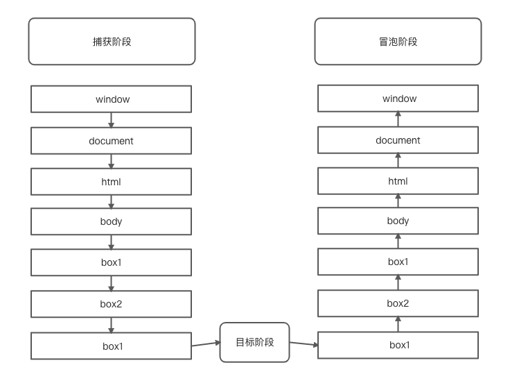

# 事件流
JavaScript中，事件流指的是DOM事件流。
## 概念
**事件的传播过程即DOM事件流。**
事件对象在 DOM 中的传播过程，被称为“事件流”。
举个例子：开电脑这个事，首先你是不是得先找到你的电脑，然后找到你的开机键，最后用手按下开机键。完成开电脑这个事件。这整个流程叫做事件流。
## DOM事件流
DOM事件，也是有一个流程的。从事件触发开始到事件响应是有三个阶段。
> 1. 事件捕获阶段
> 2. 处于目标阶段
> 3. 事件冒泡阶段

上面例子中，开电脑这个事件的过程就像JavaScript中的事件流，找开机键这个过程就是 **事件捕获** 的过程，你找到开机键后，然后用手按开机键，这个选择用手去按的过程就是 **处于目标阶段**  按下开机按钮，电脑开始开机这也就是 **事件的冒泡。** 顺序为先捕获再冒泡。

了解了事件源，让我们看看它的三个过程吧！
## 1.事件捕获
> 注：由于事件捕获不被旧版本浏览器（IE8 及以下）支持，因此实际中通常在冒泡阶段触发事件处理程序。

事件捕获处于事件流的第一步，
DOM事件触发时（被触发DOM事件的这个元素被叫作事件源），浏览器会从根节点开始 **由外到内** 进行事件传播。即事件从文档的根节点流向目标对象节点。途中经过各个层次的DOM节点，最终到目标节点，完成事件捕获。
## 2.目标阶段
当事件到达目标节点的，事件就进入了目标阶段。事件在目标节点上被触发。
就是事件传播到触发事件的最底层元素上。
## 3.事件冒泡
事件冒泡与事件捕获顺序相反。事件捕获的顺序是从外到内，事件冒泡是从内到外。
当事件传播到了目标阶段后，处于目标阶段的元素就会将接收到的时间向上传播，就是顺着事件捕获的路径，反着传播一次，逐级的向上传播到该元素的祖先元素。直到window对象。

看一个例子，点击 box3 会将 box2 与 box1 的点击事件触发。
```html
<!DOCTYPE html>
<html>

<head>
    <meta charset="UTF-8">
    <title>JavaScript 事件冒泡</title>
</head>
<style type="text/css">
    #box1 { background: blueviolet;}
    #box2 {background: aquamarine;}
    #box3 {background: tomato;}
    div { padding: 40px; margin: auto;}
</style>

<body>
    <div id="box1">
        <div id="box2">
            <div id="box3"></div>
        </div>
    </div>
    <script>
        window.onload = function () {
            const box1 = document.getElementById('box1')
            const box2 = document.getElementById('box2')
            const box3 = document.getElementById('box3')
            box1.onclick = sayBox1;
            box2.onclick = sayBox2;
            box3.onclick = sayBox3;
            function sayBox3() {
                console.log('你点了最里面的box');
            }
            function sayBox2() {
                console.log('你点了最中间的box');
            }
            function sayBox1() {
                console.log('你点了最外面的box');
            }
        }
    </script>
</body>

</html>
```
> 这个时候 click 捕获的传播顺序为：
> window -> document -> \<html> -> \<body> -> <div #box1> -> <div #box2> -> <div #box3>
> 这个时候 click 冒泡的传播顺序为：
> \<div #box3> -> \<div #box2> -> \<div #box1> -> \<body> -> \<html> ->  document -> window



> 现代浏览器都是从 window 对象开始捕获事件的，冒泡最后一站也是 window 对象。而 IE8 及以下浏览器，只会冒泡到 document 对象。
> 事件冒泡：是由元素的 HTML 结构决定，而不是由元素在页面中的位置决定，所以即便使用定位或浮动使元素脱离父元素的范围，单击元素时，其依然存在冒泡现象。

​

现在我们知道了事件流的三个阶段后，那我们可以利用这个特性做什么呢？
# 事件委托
设想这样一个场景，当你有一堆的`<li>`标签在一个`<ul>`标签下，需要给所有的`<li>`标签绑定`onclick`事件，这个问题我们可以用循环解决，但还有没有更简便的方式呢？
我们可以给这些`<li>`共同的父元素`<ul>`添加`onclick`事件，那么里面的任何一个`<li>`标签触发`onclick`事件时，都会通过冒泡机制，将`onclick`事件传播到`<ul>`上，进行处理。这个行为叫做事件委托，`<li>`利用事件冒泡将事件委托到`<ul>`上。
也可以利用事件捕获进行事件委托。用法是一样的，只是顺序反了。

```html
  <ul id="myUl">
    <li>item 1</li>
    <li>item 2</li>
    <li>item 3</li>
    ...
  </ul>
```
可能还是有点不好理解，简单来说，就是利用事件冒泡，将某个元素上的事件委托给他的父级。

举个生活中的例子，双十一快递到了，需要快递小哥送快递一般是挨家挨户送货上门，这样效率慢，小哥想了个办法，把一个小区的快递都放在小区里面的快递驿站，进行送快递的事件委托，小区的收件人能通过取件码去快递驿站领取到自己的快递。
在这里，快递小哥送快递就是一个事件，收件人就是响应事件的元素，驿站就相当于代理元素，收件人凭着收获码去驿站里面领快递就是事件执行中，代理元素判断当前响应的事件匹配该触发的具体事件。

可是这样做有什么好处呢？
## 事件委托的优点
事件委托有两个好处

1. 减少内存消耗
1. 动态绑定事件


1. 减少内存消耗，优化页面性能

在JavaScript中，每个事件处理程序都是对象，是对象就会占用页面内存，内存中的对象越多，页面的性能当然越差，而且DOM的操作是会导致浏览器对页面进行重排和重绘(这个不清楚的话，小伙伴可以了解页面的渲染过程)，过多的DOM操作会影响页面的性能。性能优化主要思想之一就是为了最小化的重排和重绘也就是减少DOM操作。

在上面给`<li>`标签绑定`onclick`事件的例子中，使用事件委托就可以不用给每一个`<li>`绑定一个函数，只需要给`<ul>`绑定一次就可以了，当li的数量很多时，无疑能减少大量的内存消耗，节约效率。

2. 动态绑定事件

如果子元素不确定或者动态生成，可以通过监听父元素来取代监听子元素。
还是上面在`<li>`标签绑定`onclick`事件的例子中， 很多时候我们的这些`<li>`标签的数量并不是固定的，会根据用户的操作对一些`<li>`标签进行增删操作。在每次增加或删除标签都要重新对新增或删除元素绑定或解绑对应事件。

可以使用事件委托就可以不用给每一个`<li>`都要操作一遍，只需要给`<ul>`绑定一次就可以了，因为事件是绑定在`<ul>`上的，`<li>`元素是影响不到`<ul>`的  ，执行到`<li>`元素是在真正响应执行事件函数的过程中去匹配的,所以使用事件委托在动态绑定事件的情况下是可以减少很多重复工作的。

我们知道了事件委托的优点，那么该如何使用呢？
## 事件委托的使用
事件委托的使用需要用的`addEventListener()`方法，事件监听。
方法将指定的监听器注册到调用该函数的对象上，当该对象触发指定的事件时，指定的回调函数就会被执行。

- 用法
```javascript
element.addEventListener(eventType, function, useCapture);
```

- 参数描述

| 参数 | 必/选填 | 描述 |
| --- | --- | --- |
| eventType | 必填 | 指定事件的类型。 |
| function | 必填 | 指定事件触发后的回调函数。 |
| useCapture | 选填 | 指定事件是在捕获阶段执行还是在冒泡阶段执行。 |

第三个参数 `useCapture` 是个布尔类型，默认值为`false`

- true - 表示事件在捕获阶段执行执行
- false- 表示事件在冒泡阶段执行执行

看下面例子
```html
<!DOCTYPE html>
<html>

<head>
  <meta charset="UTF-8">
  <title>JavaScript 事件委托</title>
</head>

<body>

  <ul>
    <li>item 1</li>
    <li>item 2</li>
    <li>item 3</li>
    <li>item 4</li>
  </ul>

  <script>
    const myUl = document.getElementsByTagName("ul")[0];

    myUl.addEventListener("click", myUlFn);

    function myUlFn(e) {
      if (e.target.tagName.toLowerCase() === 'li') { // 判断是否为所需要点击的元素
        console.log(`您点击了${e.target.innerText}`);
      }
    }

  </script>
</body>

</html>
```
⚠️  _这是一般的事件委托方法，但是这种写法有问题，就是当_`_<li>_`_中还有子元素时，点击这个子元素就不会进行触发事件。这个问题是一个坑。_

事件冒泡有时候确实很有用，但是有时候也讨人烦，当你不需要它的时候能不能取消掉呢？

# 事件委托的缺点

凡事有利必有弊

1. 事件委托有对子元素的查找过程，委托层级过深，可能会有性能问题
2. 频繁触发的事件如 mousemove、mouseout、mouseover等，不适合事件委托

# 禁止事件冒泡与捕获

_⚠️  并不是所有事件都会冒泡，比如focus，blur，change，submit，reset，select等。_

禁止冒泡和捕获可以用到方法`stopPropagation()`。
stopPropagation()起到阻止捕获和冒泡阶段中当前事件的进一步传播。
这是阻止事件的冒泡方法，进行冒泡，但是默认事件任然会执行，当你调用了这个方法后。
如果点击一个`a`标签，这个`a`标签会进行跳转。

使用起来也很简单，没有返回值也没有参数。
```javascript
event.stopPropagation();
```
请看下面例子，这个例子实在上文事件冒泡例子基础上稍加修改得到的
```html
<div id="box1">
    <div id="box2">
        <div id="box3"></div>
    </div>
</div>
<script>
    const box1 = document.getElementById('box1')
    const box2 = document.getElementById('box2')
    const box3 = document.getElementById('box3')
    box1.onclick = sayBox1;
    box2.onclick = sayBox2;
    box3.onclick = sayBox3;
    function sayBox3() {
        console.log('你点了最里面的box');
    }
    function sayBox2(e) {
        console.log('你点了最中间的box');
        e.stopPropagation(); //禁止事件捕获和冒泡
    }
    function sayBox1() {
        console.log('你点了最外面的box');
    }
</script>
```

当事件冒泡到`box2`时调用了在函数`sayBox2`，调用了`e.stopPropagation();` 就停止冒泡了。

# 参考文献
MDN中文版 [https://developer.mozilla.org/zh-CN/](https://developer.mozilla.org/zh-CN/)

知乎 [https://zhuanlan.zhihu.com/p/26536815](https://zhuanlan.zhihu.com/p/26536815)
