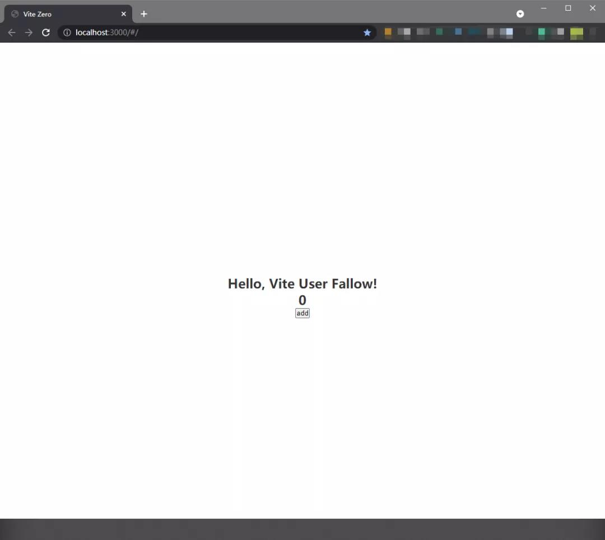

# 从零开始搭建一个vite+vue3项目

> 当我们需要开始一个项目时总是会从既有的cli创建一个项目，然后根据README的提示，直接就开始了业务逻辑的编写。但这样，只是在搬砖。了解一下这些cli都干了什么，是学习技术细节的最佳途径。本文将详细介绍一下，从零开始一步步搭建一个Vite + Vue 3的脚手架。保证是保姆级别的。

## 创建项目文件结构

在你的电脑中找一个风水极佳的地方，创建一个目录（<`project_name`>替换成你喜欢的名字）：

```bash
# 创建项目目录
mkdir -p <project_name>

# 进入该目录
cd <project_name>

# 初始化npm配置
npm init -y

# 如果你用yarn，可以这样
yarn init -y

# 如果你用pnpm，可以这样
pnpm init -y
```

此时，目录下只有一个`package.json`的文件。

然后，按照下图文件结构创建对应的文件：


至此，一个最基本的vite项目文件结构就已经准备好了。

## 安装依赖

紧接着，需要安装一系列的依赖，通过以下命令：

```bash
# 安装项目依赖
npm install vue@next vue-router@next vuex@next

# yarn的版本
yarn add vue@next vue-router@next vuex@next

# pnpm的版本
pnpm add vue@next vue-router@next vuex@next
```
项目需要的依赖，都需要加上`@next`来确保是使用的vue 3相关的版本（都2021年了，还是要加上next🤷‍♂️）。

然后，再安装一些开发环境依赖：

```bash
# 安装开发依赖
npm install vite @vitejs/plugin-vue @vue/compiler-sfc --save-dev

# yarn的版本
yarn add vite @vitejs/plugin-vue @vue/compiler-sfc -D

# pnpm的版本
pnpm add vite @vitejs/plugin-vue @vue/compiler-sfc -D
```

## 文件内容的编写

### `jsconfig.json`

jsconfig.json文件指定根文件和JavaScript语言服务提供的功能选项。<sup>[参考1]</sup>

如果不明白，直接留一个空json在里面即可：

```json
{}
```

### `package.json`

需要配置一下快捷启动的几个命令：

```js
{
  ...
  "scripts": {
    "dev": "vite",
    "build": "vite build",
    "serve": "vite preview"
  }
  ...
}
```

`dev`用于开发，`build`用于打包生产环境代码，`serve`用来在本地预览build打包的结果。

### `vite.config.js`

vite的配置文件，最基本的配置项如下：

```js
import { defineConfig } from 'vite'
import vue from '@vitejs/plugin-vue'

export default defineConfig({
  plugins: [vue()]
})
```

主要就是载入vite的vue插件。

### `index.html`

```html
<!DOCTYPE html>
<html lang="en">
<head>
  <meta charset="UTF-8">
  <meta name="viewport" content="width=device-width, initial-scale=1.0">
  <title>project_name</title>
</head>
<body>
  <div id="app"></div>
  <script type="module" src="/src/main.js"></script>
</body>
</html>
```

项目的页面文件，跟webpack的项目不一样，vite项目下的html文件是放在根目录下的。

并且有两点不同：

1. 加载程序主入口的script标签的type使用了module；

2. dev server的根目录与项目的根目录对应。

### `src/main.js`

程序的主入口：

```js
import { createApp } from "vue"
import App from "./App.vue"
import store from "./store"
import router from "./router"

createApp(App).use(store).use(router).mount("#app")
```

很好理解，跟vue2的逻辑类似，只不过在vue3中，创建应用使用的是`createApp`方法。

### `src/App.vue`

vue的主组件，简单来说，可以只放一个`router-view`让router来接管。一些公共样式也可以写在这里。

```vue
<template>
  <router-view />
</template>

<style>
/* 公共样式 */
</style>
```

### `src/router/index.js`

路由，表达方式跟vue2有一些区别：

```js
import { createRouter, createWebHashHistory } from 'vue-router'

export default createRouter({
  history: createWebHashHistory(),
  routes: [
    {
      name: 'home',
      path: '/',
      component: () => import('../views/Home.vue')
    }
  ]
})
```
历史模式有两种类型：`WebHistory`和`WebHashHistory`——区别在于，前者需要服务器端将域名访问全部指向`index.html`文件，形如`a.com/b/c`，但这种方式需要服务器配置支持； 而后者是通过url的hash来进行route，形如`a.com/#/b/c`，这是常用的一种路由方式，与服务器配置关联不大。

### `src/store/index.js`

利用vuex建立一个store，用于状态管理。

```js
import { createStore } from 'vuex'

export default createStore({
  state() {
    return {
      count: 0
    }
  },
  mutations: {
    addCount(state) {
      state.count++
    }
  }
})
```

跟以前的vuex，没有太大差别，只是创建时使用了`createStore`方法，而不是`new Store()`。从OOP到FP风格的转变很明显。

到目前为止，配置部分的工作就基本完成，我们来写点业务。

### `src/views/Home.vue`

在这个主页中我们首先加入一个`Hello`组件，该组件接受一个String类型的属性，并显示出来。

然后，在它下方，放置一个显示store数值的div，和一个点击后+1的add按钮：

```vue
<template>
  <Hello msg="Hello, Vite User Fallow!" />
  <div>{{ num }}</div>
  <button @click="add">add</button>
</template>

<script setup>
import { computed } from 'vue'
import { useStore } from "vuex"
import Hello from "../components/Hello.vue"

const store = useStore()

const num = computed(() => store.state.count)

const add = () => {
  store.commit('addCount')
}
</script>
```

可以看到与vue2相比，vue3的一些细节上发生了一些变化：

首先，template不再需要唯一根节点了，标签组织变得更符合直觉和扁平化；

其次，使用了`setup`这种`composition API`，代码的逻辑分块更清晰，组织更加灵活，喜欢偷懒的同学，甚至还能使用`script-setup`语法糖来更进一步简化代码。

对于script-setup，简单一点的理解就是在其中每个定义的变量和声明的函数，都会被暴露出去，例如上面的`Hello`组件、`num`变量和`add`方法，不需要 **显式地return** ，在template中也能正常调用。

### `src/components/Hello.vue`

```vue
<template>
  <div class="wrap">
    <div class="greet">{{ msg }}</div>
  </div>
</template>

<style scoped></style>

<script setup>
import { defineProps } from "vue";

defineProps({
  msg: {
    type: String,
    default: ''
  }
})
</script>
```

组件的属性传入使用`defineProps`。

## 运行项目

最后，跑一下代码试试：

```bash
pm run dev

# 或yarn
yarn dev

# 或pnpm
pnpm dev
```

在localhost:3000中打开页面，如果你看到如下图中所示，则你已经从零搭建起了一个vue3的开发环境。



url中增加了hash，表示router正常；点击add按钮，数字增加，表示store正常。

Enjoy coding！👨‍💻

## 参考链接

- [参考1]: [vscode中的 jsconfig.json](https://zhuanlan.zhihu.com/p/55644953)
- [参考2]: [vite 文档](https://cn.vitejs.dev/guide/)
- [参考3]: [vue 3 文档](https://v3.cn.vuejs.org/guide/introduction.html)