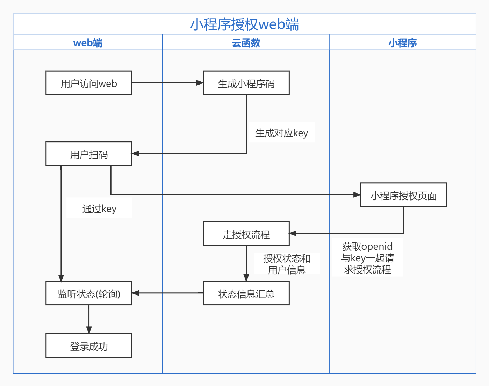

# 腾讯云开发实现 web 端的小程序扫码授权——原理篇

## 架构分析

首先，来看看整体的授权流程泳道图：

1. 首先用户在 web 端访问页面并进入扫码界面，通过匿名登录的功能可以访问云函数；
2. 云函数通过 http api 访问小程序的功能，这里需要小程序生成一个小程序码，用户才能从 web 端直达小程序，小程序码的内容包括小程序验证的 `path` 以及用以定位当前场景的 `key`；
3. 此时，web 端在进行`轮询`上一步获得的 `key`；（注：用 `socket` 更经济，但云函数没有提供这个能力，用云托管可以托管，但会有额外的成本）
4. 在小程序端用户扫描小程序码到达对应页面后，会获得用户的小程序 `openid`；
5. 在小程序端的云函数中可以对数据库中的用户数据进行查询，如果没有对应的 `openid` 记录，则在小程序端进行注册和登录，进行对应绑定；
6. 在走完授权流程后，则数据库中 `key` 所对应的小程序码状态就被修改，在 web 端轮询的结果中就获得了对应的用户数据和授权凭证。

## 选型分析

因为腾讯云的云开发和常用的微信生态有很紧密的联系，鉴于微信率如此高，所以将微信生态作为 web 端授权方式具有一定的工具基础。

同时，云开发的较低成本（新用户云开发环境一个月免费配额，早期用户每月免费配额），可以很低成本的完成整个授权流程。

再则，云开发的前后端数据库设施比较全面，应用场景中所需要的设施它都具备，并且也跟微信生态有着很紧密的联系。

最后，因为对于长时间监听状态 `socket` 肯定是最优解决方式，但由于目前云函数只支持 `api` 式的调用，所以此场景下低成本的解决方案只有用`轮询`。如果一定需要使用 `socket` ，则可以通过云托管，自建 `socket` 服务，但有额外的费用开销。

## 系列文章目录

[系列文章目录](../index.md)

---

***下期我们将对web端的实现进行介绍，敬请期待***
